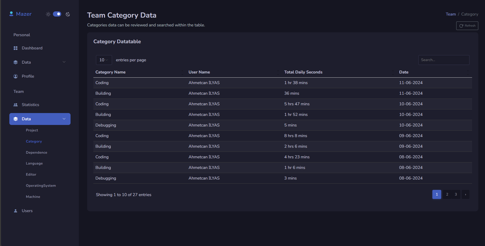

# WakaTime

The WakaTime project pulls all data from WakaTime API for company employees (team members) and records it into relevant database tables. It then uses this data to display both personal and team data on the UI. The project is developed using ASP.NET Core 8.0, utilizing Dapper, API, MVC, and Razor Page.

## Features

- **Data Retrieval and Storage**: Fetches team members' data from WakaTime API and stores it in the database.
- **Personal and Team Data**: Provides the ability to list and display personal and team data.
- **Dashboard**: Shows daily work data using pie charts, bar charts, and line charts.
- **Work Data**:
  - Project
  - Dependency
  - Category
  - Editor
  - Machine
  - Operating System
  - Total and Daily Work Hours
  - Daily Average Work Hours

## Technologies Used

- **ASP.NET Core 8.0**: Project development framework.
- **Dapper**: Micro ORM for database operations.
- **API**: Used to fetch data from WakaTime.
- **MVC**: Model-View-Controller architecture.
- **Razor Page**: Page-based model for UI creation.

## Project Structure

- **DTOs**: Data Transfer Objects.
- **Repositories**: Classes used for database operations.
- **Controllers**: Classes managing API and MVC operations.

## Development Status

This project is still under development. Personal charts have been completed, while team charts are still being developed. Future updates and improvements are planned.

## Installation

### Usage

1. Download or clone the project:
    ```sh
    git clone https://github.com/AhmetcanIlyas/WakaTime.git
    ```
2. Open the project with Visual Studio or your preferred IDE.
3. Compile and run the project.
4. Visit `http://localhost:port` in your web browser to view the project.

## Usage

1. Add your API key and other necessary information to the configuration files.
2. Start the database and begin fetching data.
3. View personal and team data on the dashboard.

## Contributing

If you would like to contribute, please submit a pull request or open an issue. All contributions are welcome!

---

For more information or if you have any questions, please contact us.

### Project Images
<table>
  <tr>
    <td align="center" style="border: none;">
      
      <p><strong>Dashboard</strong></p>
    </td>
    <td align="center" style="border: none;">
      
      <p><strong>Table</strong></p>
    </td>
  </tr>
  <tr>
    <td align="center" style="border: none;">
      
      <p><strong>API</strong></p>
    </td>
    <td align="center" style="border: none;">
      
      <p><strong>Database</strong></p>
    </td>
  </tr>
</table>
